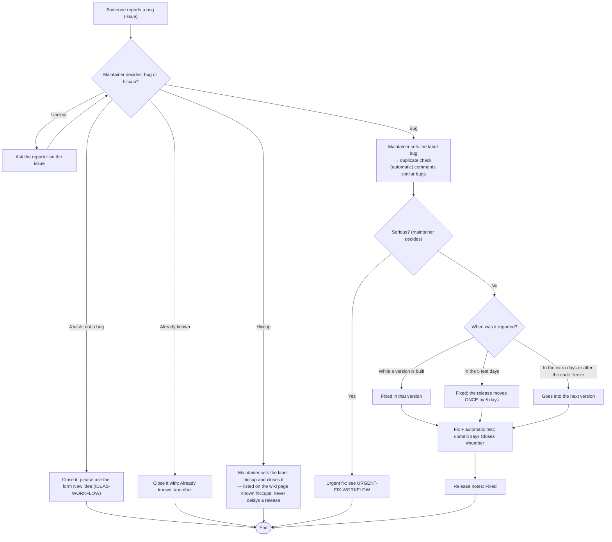

# How a bug is handled

Open bugs: [label bug](https://github.com/GFGMNET/Workspace/issues?q=is%3Aissue+is%3Aopen+label%3Abug) · Release rule: [RELEASE-WORKFLOW](RELEASE-WORKFLOW.md)

```mermaid
flowchart TD
   A["Someone reports a bug (issue)"] --> B{"Maintainer decides: bug or hiccup?"}
   B -->|A wish, not a bug| W["Close it: please use the form New idea (IDEAS-WORKFLOW)"]
   B -->|Already known| X["Close it with: Already known: #number"]
   W --> L
   X --> L
   B -->|Unclear| C["Ask the reporter on the issue"]
   C --> B
   B -->|Hiccup| D["Maintainer sets the label hiccup and closes it<br/>— listed on the wiki page Known hiccups; never delays a release"]
   B -->|Bug| E["Maintainer sets the label bug<br/>→ duplicate check (automatic) comments similar bugs"]
   F{"When was it reported?"}
   E --> S{"Serious? (maintainer decides)"}
   S -->|Yes| U["Urgent fix: see URGENT-FIX-WORKFLOW"]
   S -->|No| F
   F -->|While a version is built| G["Fixed in that version"]
   F -->|In the 5 test days| H["Fixed; the release moves ONCE by 5 days"]
   F -->|In the extra days or after the code freeze| I["Goes into the next version"]
   G --> J["Fix + automatic test; commit says Closes #number"]
   H --> J
   I --> J
   J --> K["Release notes: Fixed"]
   D --> L([End])
   U --> L
   K --> L
```
