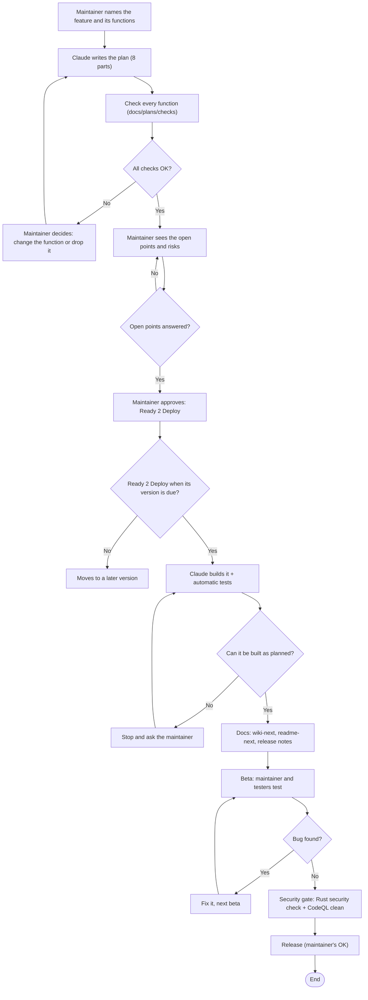

# How a new feature is made

Plans: [docs/plans](plans) · Checks: [docs/plans/checks](plans/checks)

```mermaid
flowchart TD
   A["Maintainer names the feature and its functions"] --> B["Claude writes the plan (8 parts)"]
   B --> C["Check every function (docs/plans/checks)"]
   C --> D{"All checks OK?"}
   D -->|No| E["Maintainer decides: change the function or drop it"]
   E --> B
   D -->|Yes| F["Maintainer sees the open points and risks"]
   F --> G{"Open points answered?"}
   G -->|No| F
   G -->|Yes| H["Maintainer approves: Ready 2 Deploy"]
   H --> I{"Ready 2 Deploy when its version is due?"}
   I -->|No| J["Moves to a later version"]
   I -->|Yes| K["Claude builds it + automatic tests"]
   K --> L{"Can it be built as planned?"}
   L -->|No| M["Stop and ask the maintainer"]
   M --> K
   L -->|Yes| N["Docs: wiki-next, readme-next, release notes"]
   N --> O["Beta: maintainer and testers test"]
   O --> P{"Bug found?"}
   P -->|Yes| Q["Fix it, next beta"]
   Q --> O
   P -->|No| R["Security gate: Rust security check + CodeQL clean"]
   R --> S["Release (maintainer's OK)"]
   S --> T([End])
```
