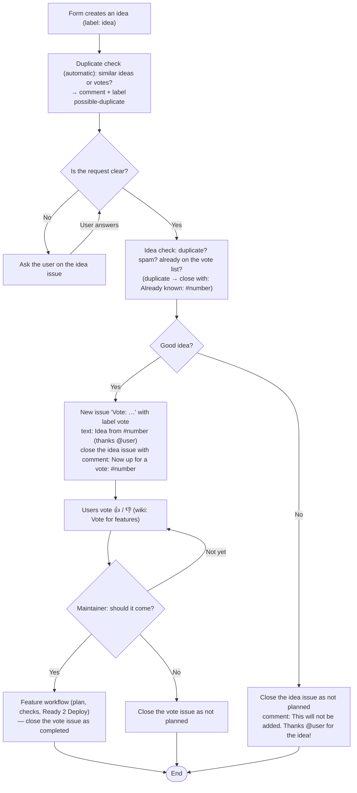

# How ideas become a vote

Form: [New idea](https://github.com/GFGMNET/Workspace/issues/new?template=new-idea.yml)

```mermaid
flowchart TD
   A["Form creates an idea (label: idea)"] --> DC["Duplicate check (automatic): similar ideas or votes?<br/>→ comment + label possible-duplicate"]
   DC --> B{"Is the request clear?"}
   B -->|No| D["Ask the user on the idea issue"]
   D -->|User answers| B
   B -->|Yes| C["Idea check: duplicate? spam? already on the vote list?<br/>(duplicate → close with: Already known: #number)"]
   C --> E{"Good idea?"}
   E -->|Yes| F["New issue 'Vote: …' with label vote<br/>text: Idea from #number (thanks @user)<br/>close the idea issue with comment: Now up for a vote: #number"]
   E -->|No| G["Close the idea issue as not planned<br/>comment: This will not be added. Thanks @user for the idea!"]
   F --> V["Users vote 👍 / 👎 (wiki: Vote for features)"]
   V --> W{"Maintainer: should it come?"}
   W -->|Yes| X["Feature workflow (plan, checks, Ready 2 Deploy)<br/>— close the vote issue as completed"]
   W -->|No| Y["Close the vote issue as not planned"]
   W -->|Not yet| V
   X --> H([End])
   Y --> H
   G --> H
```
