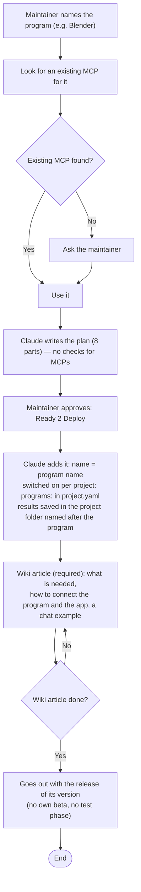

# How an MCP is added

Plans: [docs/plans](plans) (e.g. [BLENDER.md](plans/BLENDER.md))

```mermaid
flowchart TD
   A["Maintainer names the program (e.g. Blender)"] --> B["Look for an existing MCP for it"]
   B --> C{"Existing MCP found?"}
   C -->|Yes| D["Use it"]
   C -->|No| E["Ask the maintainer"]
   E --> D
   D --> F["Claude writes the plan (8 parts) — no checks for MCPs"]
   F --> G["Maintainer approves: Ready 2 Deploy"]
   G --> H["Claude adds it: name = program name<br/>switched on per project: programs: in project.yaml<br/>results saved in the project folder named after the program"]
   H --> I["Wiki article (required): what is needed,<br/>how to connect the program and the app, a chat example"]
   I --> J{"Wiki article done?"}
   J -->|No| I
   J -->|Yes| K["Goes out with the release of its version<br/>(no own beta, no test phase)"]
   K --> L([End])
```
