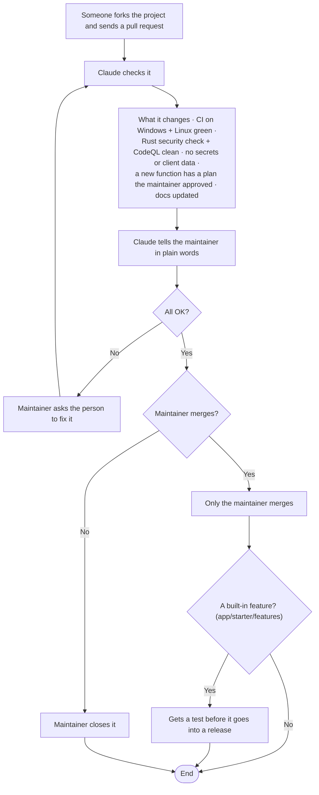

# How a pull request from others is handled

Pull requests: [open](https://github.com/GFGMNET/Workspace/pulls)

```mermaid
flowchart TD
   A["Someone forks the project and sends a pull request"] --> B["Claude checks it"]
   B --> C["What it changes · CI on Windows + Linux green ·<br/>Rust security check + CodeQL clean · no secrets or client data ·<br/>a new function has a plan the maintainer approved · docs updated"]
   C --> D["Claude tells the maintainer in plain words"]
   D --> E{"All OK?"}
   E -->|No| F["Maintainer asks the person to fix it"]
   F --> B
   E -->|Yes| G{"Maintainer merges?"}
   G -->|No| H["Maintainer closes it"]
   G -->|Yes| I["Only the maintainer merges"]
   I --> J{"A built-in feature? (app/starter/features)"}
   J -->|Yes| K["Gets a test before it goes into a release"]
   J -->|No| L([End])
   K --> L
   H --> L
```
