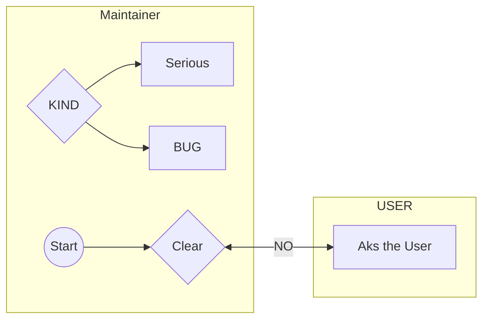

```mermaid
flowchart LR
 subgraph Maintainer
  STA@{ shape: circle, label: "Start" }
  DEA[Serious]
  BUG[BUG]
  CLE{Clear}
  KIN{KIND}
 end
 subgraph USER
  COM[Aks the User]
 end
 
 STA --> CLE
 CLE <--> |NO|COM 
 KIN --> DEA
 KIN --> BUG
 

 
```
