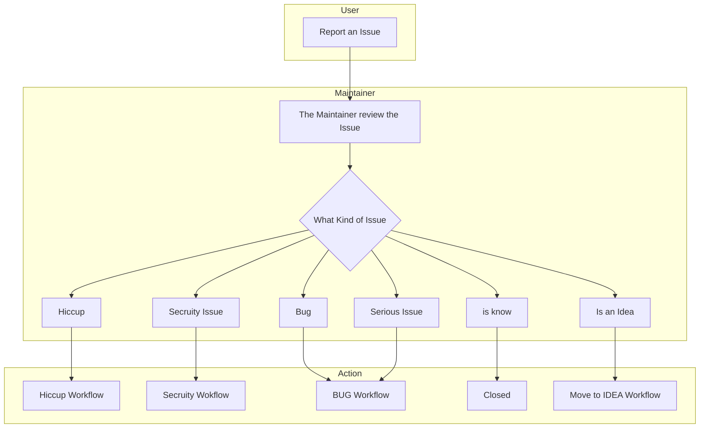

```mermaid
flowchart TD
 subgraph User
  BUG[Report an Issue]
 end
 subgraph Maintainer
  RM[The Maintainer review the Issue]
  WIF{What Kind of Issue}
  SEC[Secruity Issue]
  DEA[Serious Issue]
  BUN[Bug]
  HIC[Hiccup]
  NOR[Is an Idea]
  KNO[is know]
 end
 subgraph Action
  ADL[Hiccup Workflow]
  ASW[Secruity Wokflow]
  ABW[BUG Workflow]
  END[Closed]
  IDF[Move to IDEA Workflow]
 end
 
 BUG --> RM
 RM --> WIF
 WIF --> SEC
 WIF --> DEA
 WIF --> BUN
 WIF --> HIC
 WIF --> NOR
 WIF --> KNO
 HIC --> ADL
 BUN --> ABW
 DEA --> ABW
 SEC --> ASW
 NOR --> IDF
 KNO --> END
 
```
