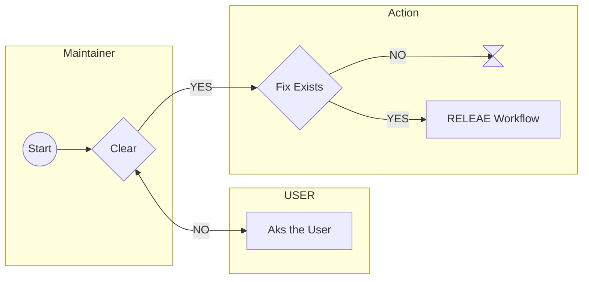

```mermaid
flowchart LR
 subgraph Maintainer
  direction TB
  STA@{ shape: circle, label: "Start" }
  CLE{Clear}
 end
 subgraph USER
  COM[Aks the User]
 end
 subgraph Action
  direction TB
  FIX{Fix Exists}
  WAU@{ shape: hourglass, label: "WAIT" }
  REL[RELEAE Workflow]
 end
STA --> CLE
CLE <--> |NO|COM
CLE --> |YES|FIX
FIX --> |NO|WAU
FIX --> |YES|REL
``` 
